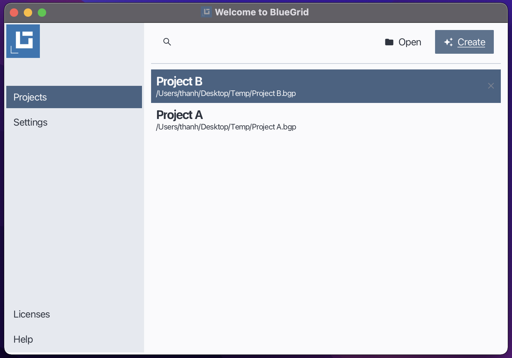
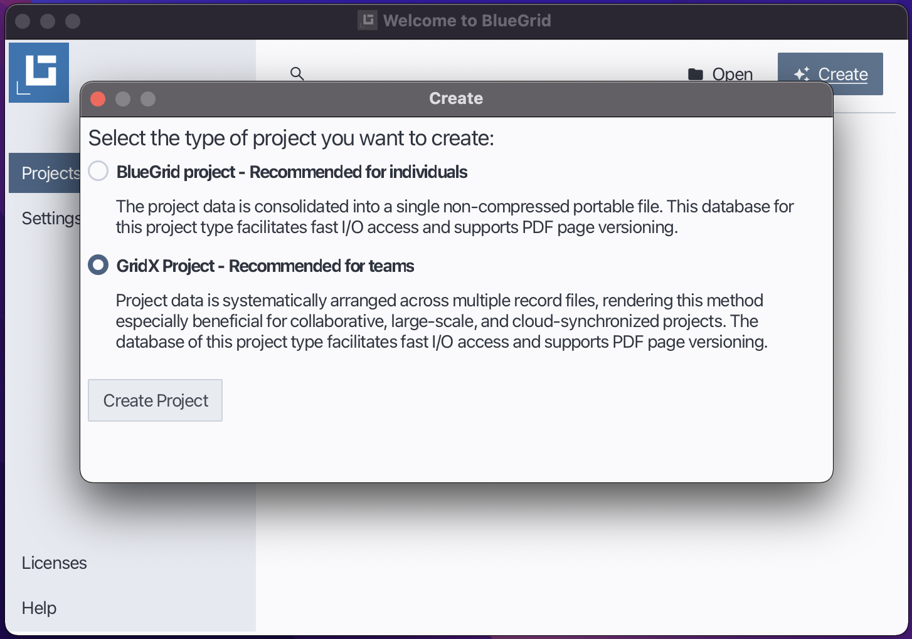
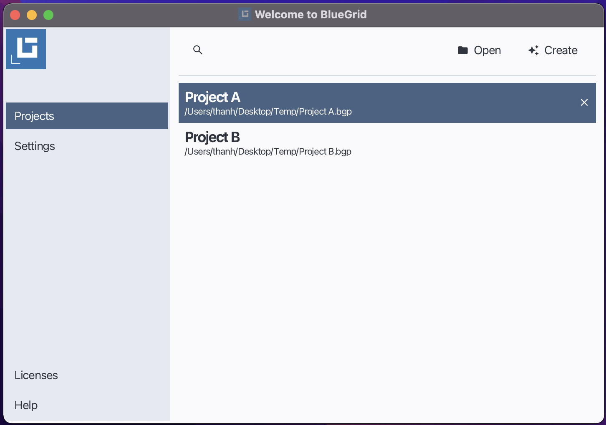
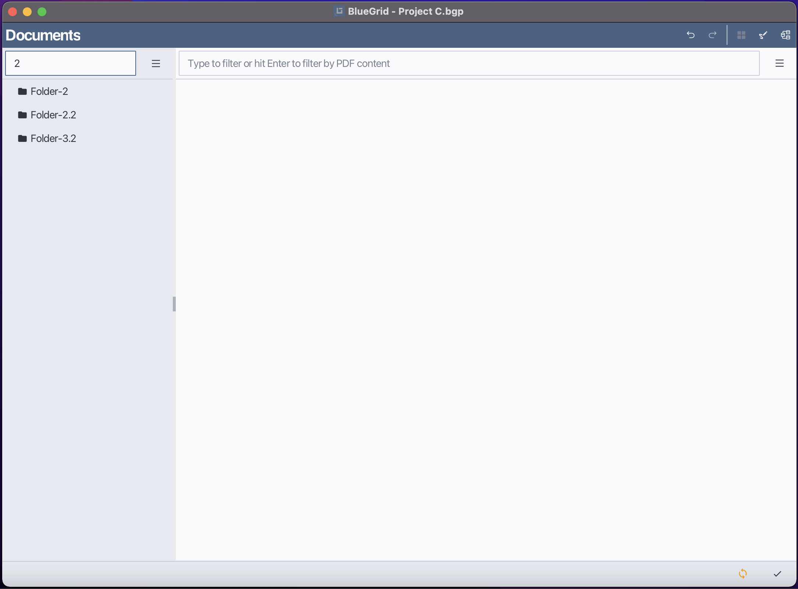
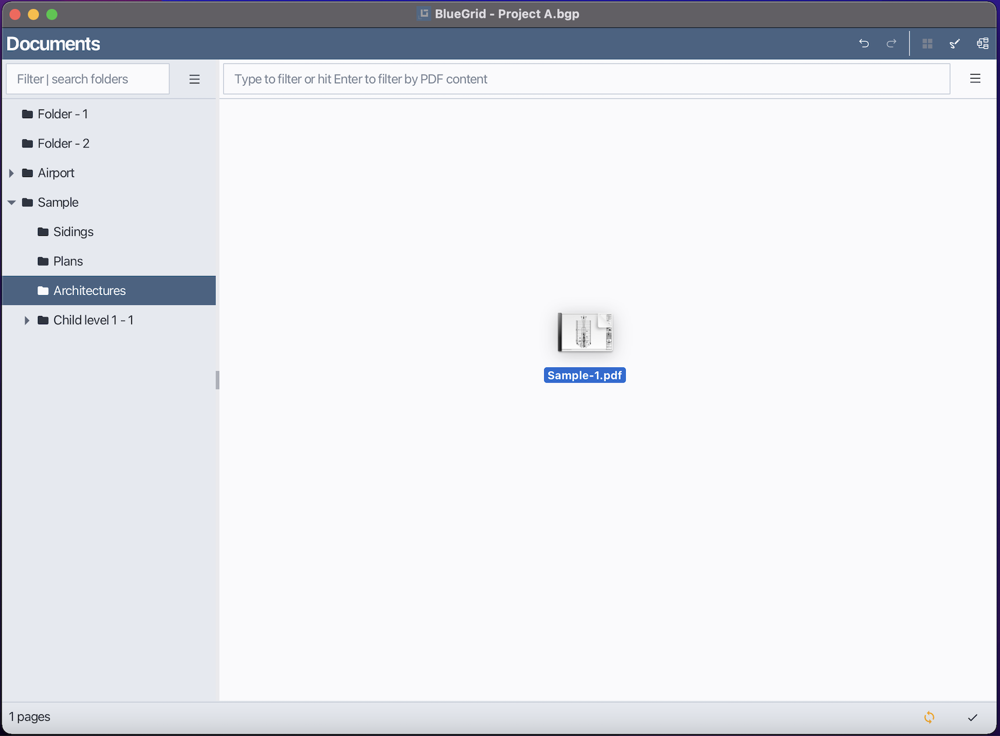
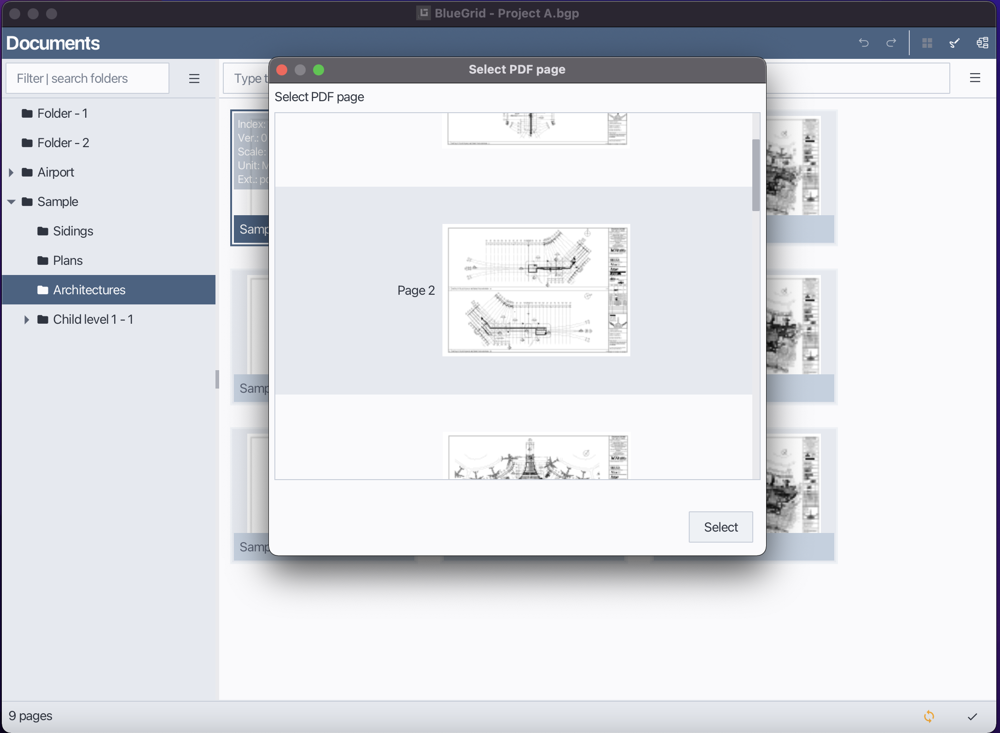
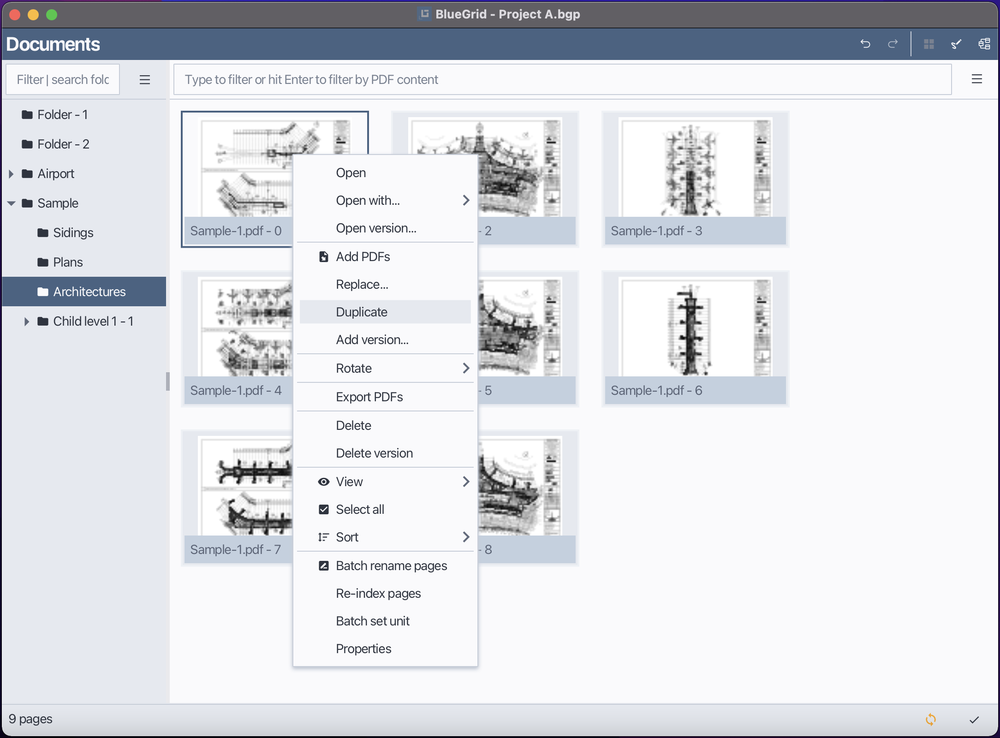
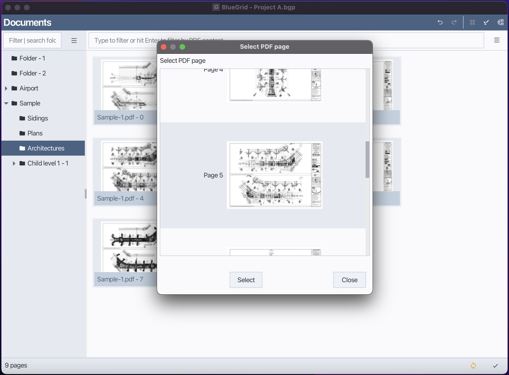
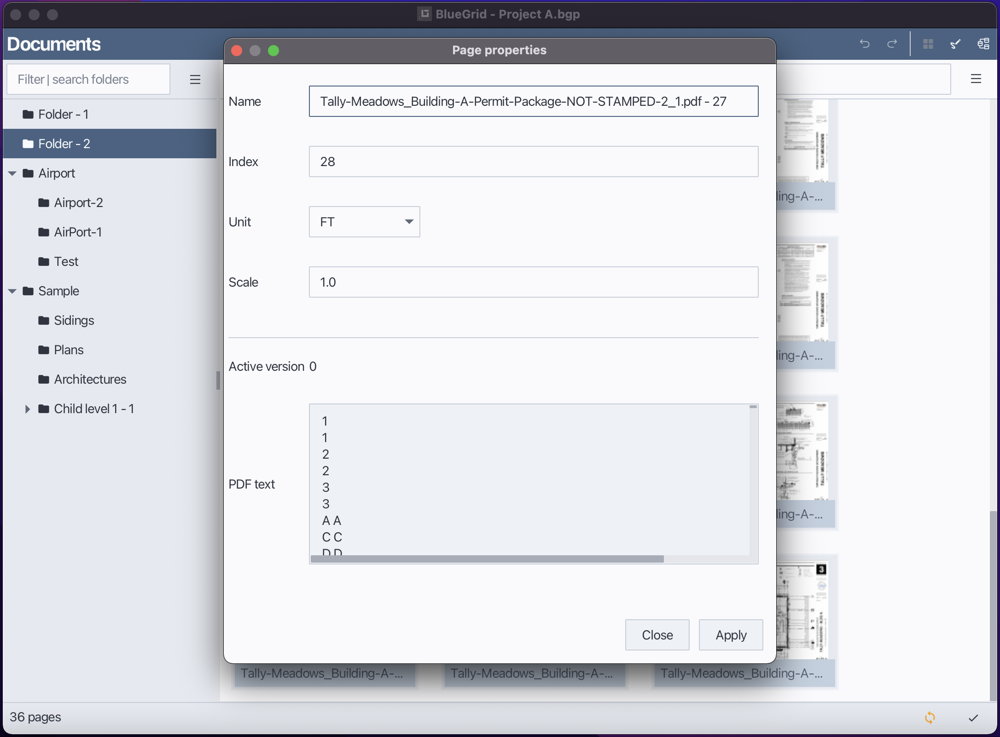
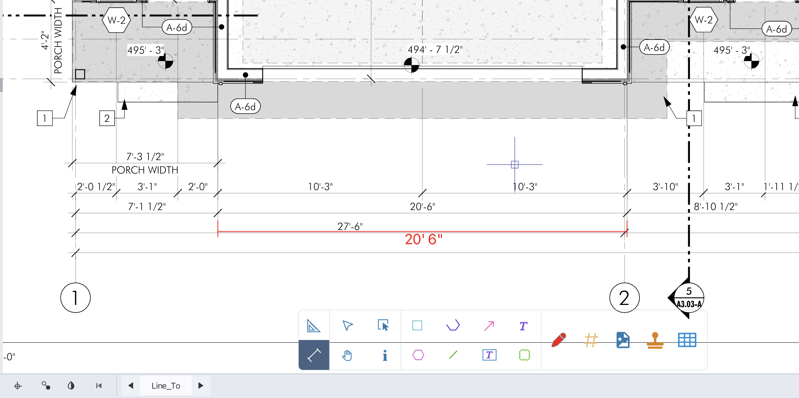

# BlueGrid Manual

## Table of Contents
1. [BlueGrid Projects](#1-bluegrid-projects)
    - [1.1 Creating a Project](#11-creating-a-project)
    - [1.2 Opening a Project](#12-opening-a-project)
2. [Document Management](#2-document-management)
    - [2.1 Folders](#21-folders)
        - [2.1.1 Creating a new folder](#211-creating-a-new-folder)
        - [2.1.2 Renaming a folder](#212-renaming-a-folder)
        - [2.1.3 Deleting a folder](#213-deleting-a-folder)
        - [2.1.4 Moving a folder to another Folder](#214-moving-a-folder-to-another-folder)
        - [2.1.5 Sorting folders](#215-sorting-folders)
        - [2.1.6 Filter folders](#216-filter-folders)
    - [2.2 Pages](#22-pages)
        - [2.2.1 Open ](#221-open-a-page)
        - [2.2.2 Open with](#222-open-with)
        - [2.2.3 Open version](#223-open-version)
        - [2.2.4 Add PDF Pages to a Folder](#224-add-pdf-pages-to-a-folder)
        - [2.2.5 Replace page](#225-replace-page)
        - [2.2.6 Duplicate](#226-duplicate-a-page)
        - [2.2.7 Add version](#227-add-versions-to-a-page)
        - [2.2.8 Rotate pages](#228-rotate-pages)
        - [2.2.9 Export PDFs](#229-export-pages)
        - [2.2.10 Delete](#2210-delete-pages)
        - [2.2.11 Delete versions](#2211-delete-versions)
        - [2.2.12 View](#2212-Change-thumbnail-size)
        - [2.2.13 Sort](#2213-Sort-pages)
        - [2.2.14 Select all](#2214-select-all-pages)
        - [2.2.15 Batch rename](#2215-batch-rename-pages)
        - [2.2.16 Batch set unit](#2216-batch-set-unit)
        - [2.2.17 Re-index pages](#2217-re-index-pages)
        - [2.2.18 Change page folder](#2218-move-a-page-to-another-folder)
        - [2.2.19 Properties](#2219-edit-page-properties)
        - [2.2.19.1 Set page name](#22191-set-page-name)
        - [2.2.19.2 Set scale](#22192-set-page-scale)
        - [2.2.19.3 Set page unit](#22193-set-page-unit)
      
3. [Draw / Takeoff](#3-draw--takeoff)
    - [3.1 Scale tool](#31-Set-page-scale-with-scale-tool)
    - [3.2 Dim tool](#32-Measure-distances-with-dim-tool)
    - [3.3 Shape tools](#31-shape-tools)
    - [3.3.1 Rectangle](#331-rectangle)
    - [3.3.2 Line](#332-line)
    - [3.3.3 Polyline](#333-polyline)
    - [3.3.3 Polygon](#334-polygon)
    - [3.3.4 Path](#335-path)
    - [3.3.5 Others](#336-other-shape-tools)
    - [3.3.6 Snap settings](#311-snap-settings)
    - [3.4 Count tools](#32-count-tools)
    - [3.5 Materials](#31-Material-table)
    - [5.5.1 Adding a new material](#351-adding-a-new-material)
    - [3.5.2 Editing a material](#352-editing-a-material)
    - [3.5.4 Importing materials](#354-importing-materials)
    - [3.5.6 Pull materials from catalog](#356-pull-materials-from-catalog)
    - [3.5.3 Deleting a material](#353-deleting-a-material)
    - [3.5.5 Exporting materials-to-csv](#355-exporting-materials-to-csv)
    - [3.5.6 Exporting materials-to-excel](#357-exporting-materials-to-excel)
    - [3.5.7 Dematerialize materials](#358-dematerialize-materials)
    - [3.5.8 List valued items](#359-list-valued-items)
    - [3.5.9 List all items](#3510-list-all-items)
    - [3.5.10 Select tagged shapes](#3511-select-tagged-shapes)
    - [3.5.11 Filter materials](#3511-filter-materials)
    - [3.5.12 Sort materials](#3512-sort-materials)
    - [3.6 Assign material to shapes to estimate quantities](#36-assign-material-to-shapes-to-estimate-quantities)
    - [3.7 Annotation tools](#337-Annotation-tools)
    - [3.8 Stamps](#38-stamps)
    - [3.9 Image tools](#39-adding-images)
    - [3.10 Drawboard menu/functions](#310-drawboard-menu-functions)
    - [3.10.1 Undo/Redo](#3101-undoredo)
    - [3.10.2 Copy](#3102-copycopy)
    - [3.10.3 Copy displace](#3103-copy-displace)
    - [3.10.4 Flip shapes](#3104-Flip-shapes)
    - [3.10.5 Flip horizontal](#3105-Flip-horizontal)
    - [3.10.6 Build path](#3106-Build-path)
    - [3.10.7 Add to symbol library](#3107-Add-to-symbol-library)
    - [3.10.8 Move shapes upward](#3108-Move-shapes-upward)
    - [3.10.9 Move shapes downward](#3109-Move-shapes-downward)
    - [3.10.10 Move shapes to top](#3110-Move-shapes-to-top)
    - [3.10.11 Move shapes to bottom](#3111-Move-shapes-to-bottom)
    - [3.10.12 Dematerialize shapes](#3112-Dematerialize-shapes)
    - [3.10.13 Select shapes](#3113-Select-shapes)
    - [3.10.14 Deselect shapes](#3114-Deselect-shapes)
    - [3.10.15 Delete shapes](#3115-Delete-shapes)

4. [Catalogs](#4-catalogs) 
    - [4.1 Overview about catalogs](#41-overview-about-catalogs)
    - [4.2 Build a catalog](#42-build-a-catalog)
    - [4.3 Import a catalog](#43-import-a-catalog)
    - [4.4 Export a catalog](#44-export-a-catalog)
---

## 1. BlueGrid Projects

### 1.1 Creating a Project
In BlueGrid, before executing a take-off project, you need to create or open a project.
Follow these steps to create a new project in BlueGrid:

1. Open the Starter Window.
2. Click **New**.
3. In the *Project Type* dialog, select one of the following:
    - **BGP Project** — Stores the entire project database in a single, portable file.
    - **GDX Project** — Stores the project database across multiple files for faster read/write performance.
4. Click **Create**.
5. In the *Save As* dialog, choose a location and enter a name for your project file.
6. Click **Save** to create the project.

    
<strong>Create a new project</strong>

    
    
    
<strong>Select project type</strong>

    

### 1.2 Opening a Project
You can open an existing project using one of the following methods:

- Click **Open** and browse to your project file and then click Open in the file dialog.

<strong>Open an existing project</strong>

- Double-click on the project from the **Recent Projects** list.

<strong>Open a recent project</strong>

    

---

## 2. Document Management

### 2.1 Folders:
**Using the Folder Menu or Context Menu by right-clicking within the folder view.**
#### 2.1.1 Creating a New Folder
In BlueGrid, PDF pages are organized into folders. A folder may contain sub-folders. You can create a new folder using either of the following methods:

1. Click the Folder menu or right-click within the folder view to open the context menu.
2. Select New.
3. Enter the folder name in the input field.
4. Click OK to confirm.

<strong>Adding new a folder</strong>

<strong>Enter folder name</strong>

#### 2.1.2 Renaming a Folder
You can rename an existing folder using either of the following methods:

1. Select the folder you want to rename.
2. Open the Folder menu and choose Rename.
3. Enter the new folder name in the input field.
4. Press Enter to confirm.

<strong>Rename a folder</strong>

#### 2.1.3 Deleting a Folder
You can delete a folder using either of the following methods:

1. Select the folder you want to delete.
2. Open the Folder menu and choose Delete.
3. Confirm the action when prompted.

<strong>Delete a folder</strong>

#### 2.1.4 Moving a Folder to another Folder
In BlueGrid, every folder may contain sub-folders or Pages. To move a folder to a different parent folder:
1. Select and hold the folder you want to move.
2. Drag the folder to the desired parent folder in the folder view.
3. Release the mouse button to complete the move.

In the demo below, Folder-4 is moved to Folder-3

<strong>Move a folder to another</strong>

#### 2.1.5 Sorting Folders
You can sort folders using either the Folder Menu or the Context Menu.
1. Open the Folder menu.
2. Select Sort. 

Sort again to reverse sorting

<strong>Sort folders</strong>

#### 2.1.6 Filter Folders
In BlueGrid, you can filter folders by typing the filtering text into folder filter field.

##### Notes
Clear the filter text to show all folders again.

### 2.2 Pages:
#### 2.2.1 Open a page
1. Select the page you want to open.
2. Double-click the page or right-click to open context menu and choose Open.

<strong>Open a page</strong>

##### Notes
By default, BlueGrid opens the latest version of a page. If you want to open a specific version, please refer to section 2.2.3 Open Version.

#### 2.2.2 Open with
BlueGrid allows users to open a page with different applications.
1. Select the page you want to open with a different application.
2. Right-click to open context menu, hover mouse to Open With. If the application you want to use is listed, click on it to open the page with that application. Otherwise, click Find to navigate the application...
3. In the Open With dialog, select the desired application from the list or browse to find a specific application.
4. Click OK to open the page with the selected application.
##### Notes
The applications users used to open pages will be saved in the Open With list for future use.

#### 2.2.3 Open version

In BlueGrid, each page can have multiple versions, each version is a PDF page or image. By default, BlueGrid opens the latest version of a page. However, users can choose to open a specific version of a page by following these steps:

1. Select the page you want to open a specific version of.
2. Use the Page Menu or Right-click to open context menu and choose Open Version.
3. In the Open Version dialog, select the desired version from the list.
4. Click OK to open the selected version of the page.

<strong>Open version</strong>

#### 2.2.4 Add PDF pages to a folder
BlueGrid allows users to import PDF pages directly into a selected folder. You can perform this action using either the Page menu, or context menu or drag-and-drop feature.
Method 1: Using the Page Menu / context menu
1. Select the folder you want to import PDF pages into.
2. Open the Page menu.
3. Click Add PDFs item
4. In the file selection dialog, choose one or more PDF files to import.
5. Click OK to begin the import process.

<strong>Add PDF pages to a folder</strong>

Method 2: Using Drag and Drop
1. Select the folder you want to import PDF pages into.
2. Drag one or more PDF files from your file system.
3. Drop them into the Page View area.
4. Confirm splitting PDF files in to pages or keep as is.

<strong>Drop files to add PDFs to a folder</strong>

<strong>Confirm splitting PDFs</strong>

#### 2.2.5 Replace page
1. Select the page you want to replace.
2. Open the Page menu or right-click to open context menu
3. Choose Replace.
4. In the file selection dialog, choose the new PDF file to replace the existing page.
5. Select the page of the new PDF file if it contains multiple pages.
5. Click OK to confirm the replacement.

<strong>Replace a page</strong>

<strong>Select page to replace with</strong>

#### 2.2.6 Duplicate a page
1. Select the page you want to duplicate.
2. Open the Page menu or right-click to open context menu
3. Choose Duplicate. 
4. A copy of the selected page will be created in the same folder.

<strong>Duplicate a page</strong>

#### 2.2.7 Add versions to a page
In BlueGrid, you can add multiple versions to a page. Each version is a separate PDF page or image associated with the main page. To add a new version to an existing page, follow these steps:
1. Select the page you want to add a version to.
2. Open the Page menu or right-click to open context menu
3. Choose Add Version.
4. In the file selection dialog, choose the new PDF file to add as a version.
5. Click OK to confirm the addition of the new version.

<strong>Add version to a page</strong>

<strong>Select the page as the new  version</strong>

#### 2.2.8 Rotate pages
1. Select the page or pages you want to rotate.
2. Open the Page menu or right-click to open context menu
3. Choose Rotate.
4. Select the desired rotation angle (90 degrees clockwise, 90 degrees counterclockwise, or 180 degrees).
5. The selected page(s) will be rotated accordingly.

<strong>Rotate a page</strong>

#### 2.2.9 Export pages
In BlueGrid, you can export one or more pages as PDF files, the exported pages will contain all user-added shapes, markups, text, annotation... To export pages, follow these steps:
1. Select the page or pages you want to export.
2. Open the Page menu or right-click to open context menu
3. Choose Export PDFs.
4. In the file selection dialog, choose the destination folder for the exported PDF files.
5. Click OK to begin the export process.

<strong>Export pages</strong>

#### 2.2.10 Delete pages
1. Select the pages you want to delete.
2. Open the Page menu or right-click to open context menu
3. Choose Delete.
4. Confirm the action when prompted.

<strong>Delete pages</strong>

#### 2.2.11 Delete versions
In BlueGrid, by doing delete version, you can remove the last PDF version of a page while keeping the main page intact.
1. Select the page whose version you want to delete.
2. Open the Page menu or right-click to open context menu    
3. Choose Delete Version

<strong>Delete page version</strong>

>

#### 2.2.12 Change thumbnail size
1. Open the Page menu or right-click to open context menu
2. Hover mouse to View
3. Select the desired thumbnail size from the available options (Small, Medium, Large).

<strong>Change thumbnail size</strong>

#### 2.2.13 Sort pages
In BlueGrid, you can sort pages either by index or by name.
1. Open the Page menu or right-click to open context menu
2. Choose Sort, then select either By Index or By Name. Sort again to reverse sorting.

<strong>Sort pages</strong>

#### 2.2.14 Select all pages
1. Open the Page menu or right-click to open context menu
2. Choose Select All.

#### 2.2.15 Batch rename pages
1. Select the pages you want to batch rename.
2. Open the Page menu or right-click to open context menu
3. Choose Batch Rename.
4. In the Batch Rename dialog, enter the new naming pattern.
5. Click OK to apply the new names to the selected pages.

<strong>Batch rename pages</strong>

   

#### 2.2.16 Batch set unit
To set the unit for multiple pages at once:
1. Select the pages you want to batch set unit.
2. Open the Page menu or right-click to open context menu
3. Choose Batch Set Unit.
4. In the Batch Set Unit dialog, select the desired unit from the list.
5. Click OK to apply the selected unit to the chosen pages.

<strong>Set unit to multiple pages</strong>

#### 2.2.17 Re-index pages
1. Select the pages you want to re-index.
2. Open the Page menu or right-click to open context menu
3. Choose Re-index.

#### 2.2.18 Move a page to another folder
1. Select and hold the page you want to move.
2. Drag the page to the desired folder in the folder view.
3. Release the mouse button to complete the move.

#### 2.2.19 Edit page properties
In BlueGrid, each page has properties such as name, scale, and unit that can be modified. To edit the properties of a page.

##### 2.2.19.1 Set page name
1. Select the page you want to edit properties for.
2. Open the Page menu or right-click to open context menu
3. Choose Properties.
4. In the Properties dialog, enter the new page name in the appropriate field.
5. Click Apply to confirm the change.

<strong>Change page name</strong>

  

##### 2.2.19.2 Set page scale
1. Select the page you want to edit properties for.
2. Open the Page menu or right-click to open context menu
3. Choose Properties.
4. In the Properties dialog, enter the new scale value in the appropriate field.
5. Click Apply to confirm the change.

<strong>Change page scale</strong>
  

##### 2.2.19.3 Set page unit
1. Select the page you want to edit properties for.
2. Open the Page menu or right-click to open context menu
3. Choose Properties.
4. In the Properties dialog, select the desired unit from the dropdown menu.
5. Click OK to confirm the change.

<strong>Change page unit</strong>

## 3. Draw / Takeoff
### 3.1 Set page scale with scale tool
In BlueGrid, setting the correct scale for your drawing is crucial for accurate measurements and takeoffs. The Scale Tool allows you to define the scale of your drawing by specifying a known distance on the page. To set the page scale using the Scale Tool, follow these steps:
1. In  the  Draw view select the Scale Tool from the toolbar.
2. Click on the starting point of the known distance on the drawing.
3. Move the cursor to the endpoint of the known distance and click again.
4. In the Scale dialog, enter the actual distance that corresponds to the drawn distance.
5. Click Apply to apply the scale to the page.

<strong>Set page scale with Scale Tool</strong>

### 3.2 Measure distances with dim tool
The Dim Tool in BlueGrid allows you to measure distances directly on your drawing. This tool is useful for verifying dimensions and ensuring accuracy in your takeoffs. To have correct distance measurement, page scale should be set in advance.
To measure distances using the Dim Tool, follow these steps:
1. In the Draw view, select the Dim Tool from the toolbar.
2. Click on the starting point of the distance you want to measure.
3. Move the cursor to the endpoint of the distance and click again.
4. The measured distance will be displayed on the drawing.

<strong>Measure distances with Dim Tool</strong>

   

### 3.3 Shape tools
BlueGrid provides a variety of shape tools that allow you to create different geometric shapes on your PDF page. These shapes can be used for takeoffs, annotations, and other purposes. The available shape tools include Rectangle, Line, Polyline, Polygon, Path, and more. Below are the descriptions of each shape tool and how to use them.

Shape tool

#### 3.3.1 Rectangle
The Rectangle Tool allows you to create rectangular shapes on your drawing. To use the Rectangle Tool, follow these steps:
1. In the Draw view, select the Rectangle Tool from the toolbar.
2. Click the left mouse button at the starting point of the rectangle.
3. Move the mouse to define the size of the rectangle.
4. Click the left mouse button again to complete the rectangle.

<strong>Create rectangle shape</strong>

#### 3.3.2 Polyline
The Polyline Tool allows you to create a series of connected line segments. A polyline is usually used to take-off linear items. To use the Polyline Tool, follow these steps:
1. In the Draw view, select the Polyline Tool from the toolbar.
2. Click the left mouse button at the starting point of the polyline.
3. Move the mouse to the next point and click again to create a line segment.
4. Repeat step 3 to add more segments.
5. Right-click to complete the polyline.

<strong>Create polyline shape</strong>

#### 3.3.3 Polygon
The Polygon Tool allows you to create closed shapes with multiple sides. A polygon is usually used to take-off area items. To use the Polygon Tool, follow these steps:
1. In the Draw view, select the Polygon Tool from the toolbar.
2. Click the left mouse button at the starting point of the polygon.
3. Move the mouse to the next vertex and click again to create a side.
4. Repeat step 3 to add more sides.
5. Right-click to complete the polygon.

<strong>Create polygon shape</strong>

