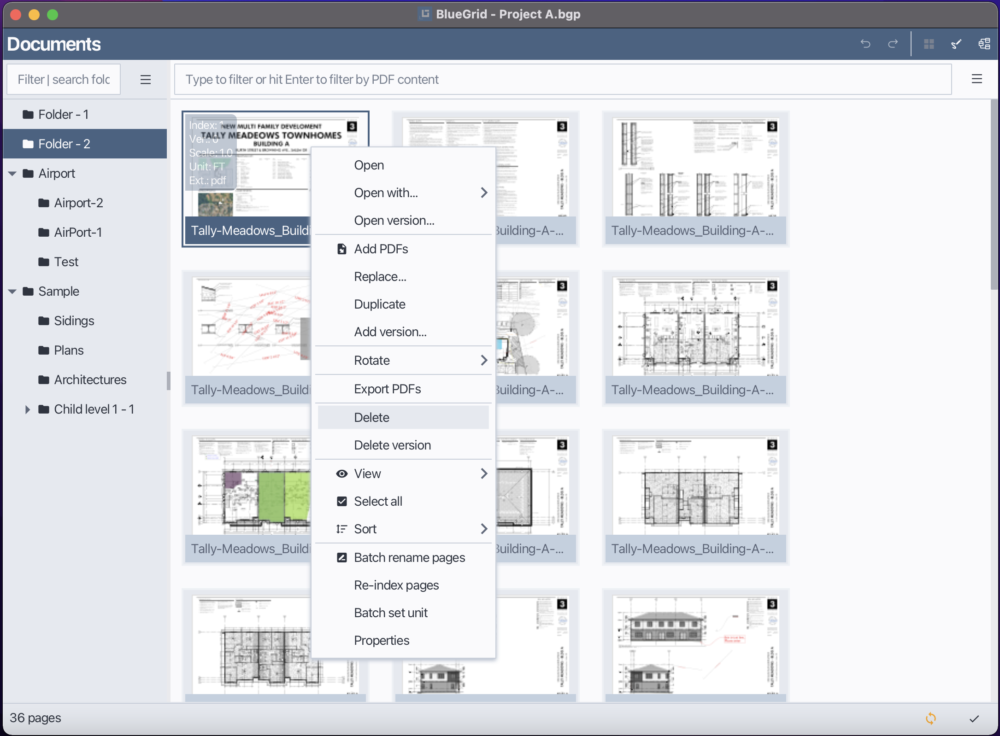
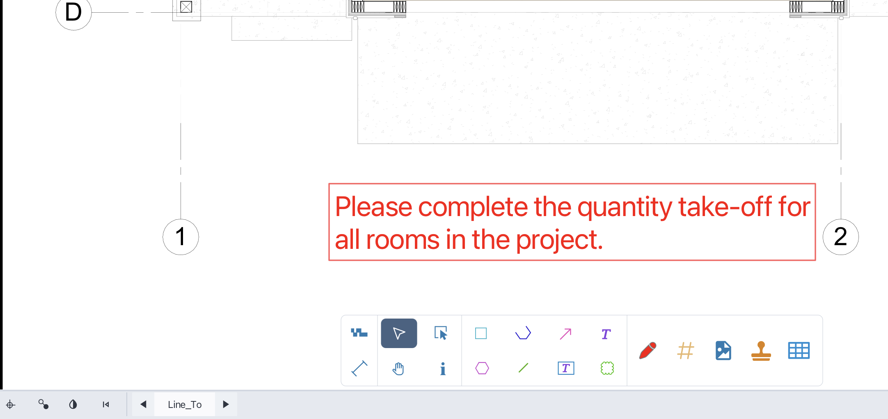
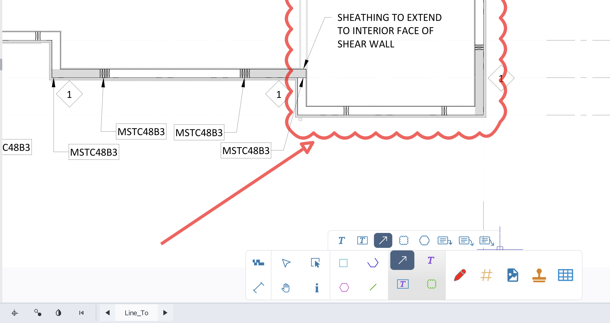
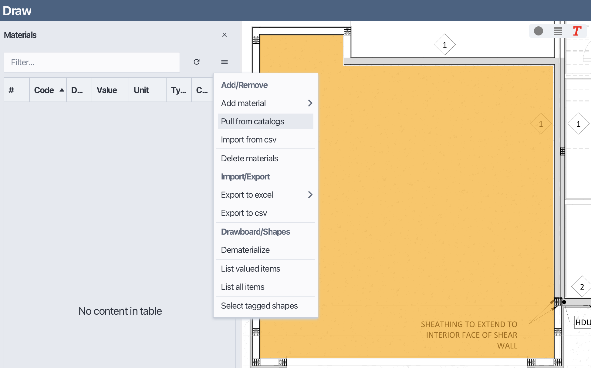
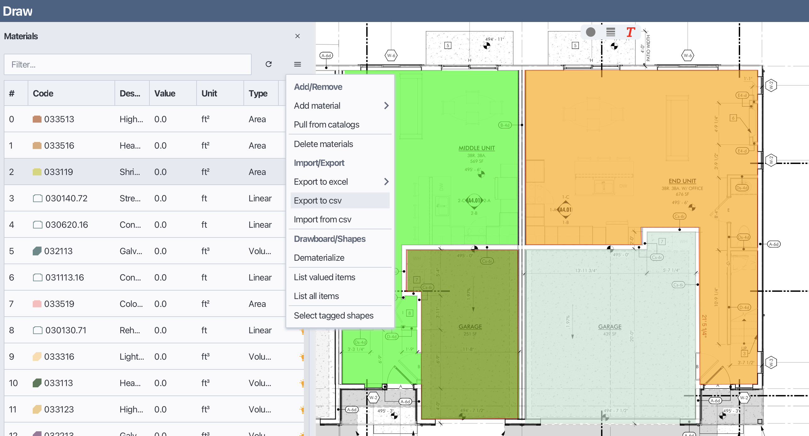
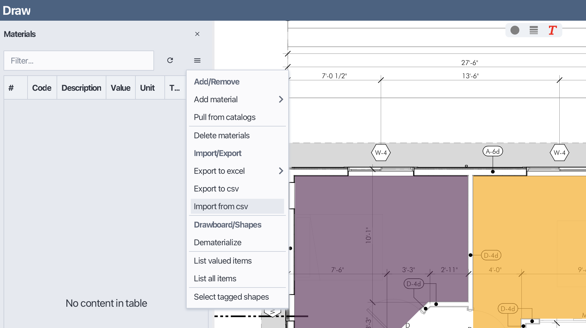
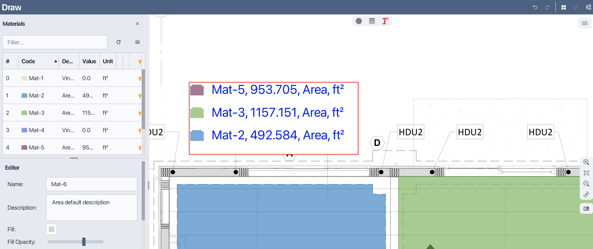
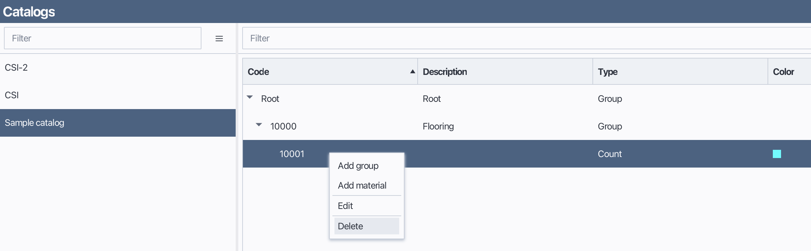

# BlueGrid Manual

## Table of Contents
1. [BlueGrid Projects](#1-bluegrid-projects)
    - [1.1 Creating a Project](#11-creating-a-project)
    - [1.2 Opening a Project](#12-opening-a-project)
2. [Document Management](#2-document-management)
    - [2.1 Folders](#21-folders)
    - [2.1.1 Add a new folder](#211-creating-a-new-folder)
    - [2.1.2 Rename a folder](#212-renaming-a-folder)
    - [2.1.3 Delete a folder](#213-deleting-a-folder)
    - [2.1.4 Move a folder to another Folder](#214-moving-a-folder-to-another-folder)
    - [2.1.5 Sort folders](#215-sorting-folders)
    - [2.1.6 Filter folders](#216-filter-folders)
    - [2.2 Pages](#22-pages)
    - [2.2.1 Open ](#221-open-a-page)
    - [2.2.2 Open with](#222-open-with)
    - [2.2.3 Open version](#223-open-version)
    - [2.2.4 Add PDF Pages to a Folder](#224-add-pdf-pages-to-a-folder)
    - [2.2.5 Replace page](#225-replace-page)
    - [2.2.6 Duplicate](#226-duplicate-a-page)
    - [2.2.7 Add version](#227-add-versions-to-a-page)
    - [2.2.8 Rotate pages](#228-rotate-pages)
    - [2.2.9 Export PDFs](#229-export-pages)
    - [2.2.10 Delete](#2210-delete-pages)
    - [2.2.11 Delete versions](#2211-delete-versions)
    - [2.2.12 View](#2212-Change-thumbnail-size)
    - [2.2.13 Sort](#2213-Sort-pages)
    - [2.2.14 Select all](#2214-select-all-pages)
    - [2.2.15 Batch rename](#2215-batch-rename-pages)
    - [2.2.16 Batch set unit](#2216-batch-set-unit)
    - [2.2.17 Re-index pages](#2217-re-index-pages)
    - [2.2.18 Change page folder](#2218-move-a-page-to-another-folder)
    - [2.2.19 Properties](#2219-edit-page-properties)
    - [2.2.19.1 Set page name](#22191-set-page-name)
    - [2.2.19.2 Set scale](#22192-set-page-scale)
    - [2.2.19.3 Set page unit](#22193-set-page-unit)
      
3. [Draw / Takeoff](#3-draw--takeoff)
    - [3.1 Scale tool](#31-Set-page-scale-with-scale-tool)
    - [3.2 Dim tool](#32-Measure-distances-with-dim-tool)
    - [3.3 Mouse tools ](#33-Pan-Select-tool)
    - [3.3.1 Pan tool](#331-Pan-tool)
    - [3.3.2 Select tool](#332-Select-tool)
    - [3.3.3 PDF-Shape select tool](#333-Select-PDF-Shape-tool)
    - [3.4 Shape tools](#34-shape-tools)
    - [3.4.1 Rectangle](#341-rectangle)
    - [3.4.2 Polyline](#342-polyline)
    - [3.4.3 Polygon](#343-polygon)
    - [3.4.4 Line](#344-line)
    - [3.4.5 Path](#345-path)
    - [3.4.6 Others](#346-other-shape-tools)
    - [3.5 Annotation tools](#35-Annotation-tools)
    - [3.5.1 Text tool](#351-Text-tool)
    - [3.5.2 Textbox tool](#352-Textbox-tool)
    - [3.5.3 Cloud tool](#353-Cloud-tool)
    - [3.5.4 Arrow tool](#354-Arrow-tool)
    - [3.5.5 Callout tool](#355-Callout-tool)
    - [3.6 Count tools](#36-count-tools)
    - [3.7 Stamps](#37-stamps)
    - [3.8 Snap settings](#38-point-snaps)
    - [3.9 Material table](#39-Material-table)
    - [3.9.1 Adding a new material](#391-adding-a-new-material)
    - [3.9.2 Editing a material](#392-editing-a-material)
    - [3.9.3 Importing materials](#393-importing-materials)
    - [3.9.4 Pull materials from catalog](#394-pull-materials-from-catalog)
    - [3.9.5 Deleting a material](#395-deleting-a-material)
    - [3.9.6 Exporting materials-to-csv](#396-exporting-materials-to-csv)
    - [3.9.7 Exporting materials-to-excel](#397-exporting-materials-to-excel)
    - [3.9.8 Dematerialize materials](#398-dematerialize-materials)
    - [3.9.9 List material items](#399-list-valued-items)
    - [3.9.10 Select tagged shapes](#3910-select-tagged-shapes)
    - [3.9.11 Filter materials](#3911-filter-materials)
    - [3.9.12 Sort materials](#3912-sort-materials)
    - [3.9.13 Assign material to shapes to estimate quantities](#3913-assign-material-to-shapes-to-estimate-quantities)
    - [3.10 Drawboard menu/functions](#310-drawboard-menu-functions)
    - [3.10.1 Undo/Redo](#3101-undoredo)
    - [3.10.2 Copy](#3102-copy)
    - [3.10.3 Copy displace](#3103-copy-displace)
    - [3.10.4 Flip shapes](#3104-Flip-shapes)
    - [3.10.5 Flip horizontal](#3105-Flip-horizontal)
    - [3.10.6 Build path](#3106-Build-path)
    - [3.10.7 Add to symbol library](#3107-Add-to-symbol-library)
    - [3.10.8 Move shapes upward](#3108-Move-shapes-upward)
    - [3.10.9 Move shapes downward](#3109-Move-shapes-downward)
    - [3.10.10 Move shapes to top](#31010-Move-shapes-to-top)
    - [3.10.11 Move shapes to bottom](#31011-Move-shapes-to-bottom)
    - [3.10.12 Dematerialize shapes](#31012-Dematerialize-shapes)
    - [3.10.13 Select shapes](#31013-Select-shapes)
    - [3.10.14 Deselect shapes](#31014-Deselect-shapes)
    - [3.10.15 Delete shapes](#31015-Delete-shapes)

4. [Catalogs](#4-catalogs) 
    - [4.1 Overview about catalogs](#41-overview-about-catalogs)
    - [4.2 Build a catalog](#42-build-a-catalog)
    - [4.3 Import a catalog](#43-import-a-catalog)
    - [4.4 Export a catalog](#44-export-a-catalog)

---

## 1. BlueGrid Projects

### 1.1 Creating a Project
In BlueGrid, before executing a take-off project, you need to create or open a project.
Follow these steps to create a new project in BlueGrid:

1. Open the Starter Window.
2. Click **New**.
3. In the *Project Type* dialog, select one of the following:
    - **BGP Project** — Stores the entire project database in a single, portable file.
    - **GDX Project** — Stores the project database across multiple files for faster read/write performance.
4. Click **Create**.
5. In the *Save As* dialog, choose a location and enter a name for your project file.
6. Click **Save** to create the project.

    
<strong>Create a new project</strong>

    
    
    
Select project type

    

### 1.2 Opening a Project
You can open an existing project using one of the following methods:

- Click **Open** and browse to your project file and then click Open in the file dialog.

Open an existing project

- Double-click on the project from the **Recent Projects** list.

Open a recent project

    

---

## 2. Document Management

### 2.1 Folders:
**Using the Folder Menu or Context Menu by right-clicking within the folder view.**
#### 2.1.1 Creating a New Folder
In BlueGrid, PDF pages are organized into folders. A folder may contain sub-folders. You can create a new folder using the following methods:

1. Click the Folder menu or right-click within the folder view to open the context menu.
2. Select New.
3. Enter the folder name in the input field.
4. Click OK to confirm.

##### Notes: In a folder, folder names must be unique.

Adding new a folder

<strong>Enter folder name</strong>

#### 2.1.2 Renaming a folder
You can rename an existing folder using either of the following methods:

1. Select the folder you want to rename.
2. Open the Folder menu or right-click to open context menu and choose Rename.
3. Enter the new folder name in the input field.
4. Press Enter to confirm.

Rename a folder

#### 2.1.3 Deleting a Folder
You can delete a folder using either of the following methods:

1. Select the folder you want to delete.
2. Open the Folder menu and choose Delete.
3. Confirm the action when prompted.

Delete a folder

#### 2.1.4 Moving a Folder to another Folder
In BlueGrid, every folder may contain sub-folders or Pages. To move a folder to a different parent folder:
1. Select and hold the folder you want to move.
2. Drag the folder to the desired parent folder in the folder view.
3. Release the mouse button to complete the move.

In the demo below, Folder-4 is moved to Folder-3

Move a folder to another

#### 2.1.5 Sorting Folders
You can sort folders using either the Folder Menu or the Context Menu.
1. Open the Folder menu.
2. Select Sort. 

Sort again to reverse sorting

Sort folders

#### 2.1.6 Filter Folders
In BlueGrid, you can filter folders by typing the filtering text into folder filter field.

##### Notes
Clear the filter text to show all folders again.

### 2.2 Pages:
#### 2.2.1 Open a page
1. Select the page you want to open.
2. Double-click the page or right-click to open context menu and choose Open.

Open a page

##### Notes:
By default, BlueGrid opens the latest version of a page. If you want to open a specific version, please refer to section 2.2.3 Open Version.

#### 2.2.2 Open with
BlueGrid allows users to open a page with different applications.
1. Select the page you want to open with a different application.
2. Right-click to open context menu, hover mouse to Open With. If the application you want to use is listed, click on it to open the page with that application. Otherwise, click Find to navigate the application...
3. In the Open With dialog, select the desired application from the list or browse to find a specific application.
4. Click OK to open the page with the selected application.

Open with external programs

 

##### Notes:
The applications users used to open pages will be saved in the Open With list for future use.

#### 2.2.3 Open version

In BlueGrid, each page can have multiple versions, each version is a PDF page or image. By default, BlueGrid opens the latest version of a page. However, users can choose to open a specific version of a page by following these steps:

1. Select the page you want to open a specific version of.
2. Use the Page Menu or Right-click to open context menu and choose Open Version.
3. In the Open Version dialog, select the desired version from the list.
4. Click OK to open the selected version of the page.

Open version

#### 2.2.4 Add PDF pages to a folder
BlueGrid allows users to import PDF pages directly into a selected folder. You can perform this action using either the Page menu, or context menu or drag-and-drop feature.

Method 1: Using the Page Menu / context menu
1. Select the folder you want to import PDF pages into.
2. Open the Page menu.
3. Click Add PDFs item
4. In the file selection dialog, choose one or more PDF files to import.
5. Click Yes or No to either split the files into pages or keep them as they are.

Add PDF pages to a folder

Method 2: Using Drag and Drop
1. Select the folder you want to import PDF pages into.
2. Drag one or more PDF files from your file system.
3. Drop them into the Page View area.
4. Click Yes or No to either split the files into pages or keep them as they are.

Drop files to add PDFs to a folder

Confirm splitting PDFs

#### 2.2.5 Replace page
1. Select the page you want to replace.
2. Open the Page menu or right-click to open context menu
3. Choose Replace.
4. In the file selection dialog, choose the new PDF file to replace the existing page.
5. Select the page of the new PDF file if it contains multiple pages.
6. Click OK to confirm the replacement.

Replace a page

Select page to replace with

#### 2.2.6 Duplicate a page
1. Select the page you want to duplicate.
2. Open the Page menu or right-click to open context menu
3. Choose Duplicate. 
4. A copy of the selected page will be created in the same folder.

Duplicate a page

#### 2.2.7 Add versions to a page
In BlueGrid, you can add multiple versions to a page. Each version is a separate PDF page or image associated with the main page. To add a new version to an existing page, follow these steps:
1. Select the page you want to add a version to.
2. Open the Page menu or right-click to open context menu
3. Choose Add Version.
4. In the file selection dialog, choose the new PDF file to add as a version.
5. Click OK to confirm the addition of the new version.

Add version to a page

Select the page as the new  version

#### 2.2.8 Rotate pages
1. Select the page or pages you want to rotate.
2. Open the Page menu or right-click to open context menu
3. Choose Rotate.
4. Select the desired rotation angle (90 degrees clockwise, 90 degrees counterclockwise, or 180 degrees).
5. The selected page(s) will be rotated accordingly.

Rotate a page

#### 2.2.9 Export pages
In BlueGrid, you can export one or more pages as PDF files, the exported pages will contain all user-added shapes, markups, text, annotation... To export pages, follow these steps:
1. Select the page or pages you want to export.
2. Open the Page menu or right-click to open context menu
3. Choose Export PDFs.
4. In the file selection dialog, choose the destination folder for the exported PDF files.
5. Click OK to begin the export process.

Export pages

#### 2.2.10 Delete pages
1. Select the pages you want to delete.
2. Open the Page menu or right-click to open context menu
3. Choose Delete.
4. Confirm the action when prompted.

Delete pages

#### 2.2.11 Delete versions
In BlueGrid, by doing delete version, you can remove the last PDF version of a page while keeping the main page intact.
1. Select the page whose version you want to delete.
2. Open the Page menu or right-click to open context menu    
3. Choose Delete Version

Delete page version

>

#### 2.2.12 Change thumbnail size
1. Open the Page menu or right-click to open context menu
2. Hover mouse to View
3. Select the desired thumbnail size from the available options (Small, Medium, Large).

Change thumbnail size

#### 2.2.13 Sort pages
In BlueGrid, you can sort pages either by index or by name.
1. Open the Page menu or right-click to open context menu
2. Choose Sort, then select either By Index or By Name. Sort again to reverse sorting.

Sort pages

#### 2.2.14 Select all pages
1. Open the Page menu or right-click to open context menu
2. Choose Select All.

#### 2.2.15 Batch rename pages
1. Select the pages you want to batch rename.
2. Open the Page menu or right-click to open context menu
3. Choose Batch Rename.
4. In the Batch Rename dialog, enter the new naming pattern.
5. Click OK to apply the new names to the selected pages.

Batch rename pages

   

#### 2.2.16 Batch set unit
To set the unit for multiple pages at once:
1. Select the pages you want to batch set unit.
2. Open the Page menu or right-click to open context menu
3. Choose Batch Set Unit.
4. In the Batch Set Unit dialog, select the desired unit from the list.
5. Click OK to apply the selected unit to the chosen pages.

Set unit to multiple pages

#### 2.2.17 Re-index pages
1. Select the pages you want to re-index.
2. Open the Page menu or right-click to open context menu
3. Choose Re-index.

#### 2.2.18 Move a page to another folder
1. Select and hold the page you want to move.
2. Drag the page to the desired folder in the folder view.
3. Release the mouse button to complete the move.

Move a page to another folder

#### 2.2.19 Edit page properties
In BlueGrid, each page has properties such as name, scale, and unit that can be modified. To edit the properties of a page.

##### 2.2.19.1 Set page name
1. Select the page you want to edit properties for.
2. Open the Page menu or right-click to open context menu
3. Choose Properties.
4. In the Properties dialog, enter the new page name in the appropriate field.
5. Click Apply to confirm the change.

Change page name

  

##### 2.2.19.2 Set page scale
1. Select the page you want to edit properties for.
2. Open the Page menu or right-click to open context menu
3. Choose Properties.
4. In the Properties dialog, enter the new scale value in the appropriate field.
5. Click Apply to confirm the change.

Change page scale
  

##### 2.2.19.3 Set page unit
1. Select the page you want to edit properties for.
2. Open the Page menu or right-click to open context menu
3. Choose Properties.
4. In the Properties dialog, select the desired unit from the dropdown menu.
5. Click OK to confirm the change.

Change page unit

## 3. Draw / Takeoff
### 3.1 Set page scale with scale tool
In BlueGrid, setting the correct scale for your drawing is crucial for accurate measurements and takeoffs. The Scale Tool allows you to define the scale of your drawing by specifying a known distance on the page. To set the page scale using the Scale Tool, follow these steps:
1. In  the  Draw view select the Scale Tool from the toolbar.
2. Click on the starting point of the known distance on the drawing.
3. Move the cursor to the endpoint of the known distance and click again.
4. In the Scale dialog, enter the actual distance that corresponds to the drawn distance.
5. Click Apply to apply the scale to the page.

Set page scale with Scale Tool

### 3.2 Measure distances with dim tool
The Dim Tool in BlueGrid allows you to measure distances directly on your drawing. This tool is useful for verifying dimensions and ensuring accuracy in your takeoffs. To have correct distance measurement, page scale should be set in advance.
To measure distances using the Dim Tool, follow these steps:
1. In the Draw view, select the Dim Tool from the toolbar.
2. Click on the starting point of the distance you want to measure.
3. Move the cursor to the endpoint of the distance and click again.
4. The measured distance will be displayed on the drawing.

Measure distances with Dim Tool

   

### 3.3 Pan / Select tool

#### 3.3.1 Pan tool
The Pan Tool allows you to navigate around your drawing by clicking and dragging the view. To use the Pan Tool, follow these steps:
1. In the Draw view, select the Pan Tool from the toolbar.
2. Click and hold the left mouse button on the drawing area.
3. Move the mouse to pan around the drawing.
4. Release the mouse button to stop panning.

Pan tool

#### 3.3.2 Select tool
The Select Tool allows you to select shapes and objects on your drawing for editing or manipulation. To use the Select Tool, follow these steps:
##### 3.3.2.1 Select single shape
1. In the Draw view, select the Select Tool from the toolbar.
2. Click on a shape or object to select it. To select multiple shapes, hold down the Control key while clicking on each shape.
3. Once selected, you can move, resize, or modify the shapes as needed.

##### 3.3.2.2 Select multiple shapes
1. In the Draw view, select the Select Tool from the toolbar.
2. Click and hold the left mouse button on an empty area of the drawing.
3. Drag the mouse to create a selection rectangle that encompasses the shapes you want to select.
4. Release the mouse button to complete the selection. All shapes within the rectangle will be selected.

Select multiple shapes with Select tool

##### 3.3.3 Select PDF-Shape tool
The Select PDF-Shape Tool allows you to select and manipulate shapes that are part of the original PDF content. To use the Select PDF-Shape Tool, follow these steps:
1. In the Draw view, select the Select PDF-Shape Tool from the toolbar.
2. Press and hold the left mouse button and drag to create a selection rectangle around the PDF shapes you want to select.
3. Release the mouse button to complete the selection. All PDF shapes within the rectangle will be selected.

### 3.4 Shape tools
BlueGrid provides a variety of shape tools that allow you to create different geometric shapes on your PDF page. These shapes can be used for takeoffs, annotations, and other purposes. The available shape tools include Rectangle, Line, Polyline, Polygon, Path, and more. Below are the descriptions of each shape tool and how to use them.

Shape tool

#### 3.4.1 Rectangle
The Rectangle Tool allows you to create rectangular shapes on your drawing. To use the Rectangle Tool, follow these steps:
1. In the Draw view, select the Rectangle Tool from the toolbar.
2. Click the left mouse button at the starting point of the rectangle.
3. Move the mouse to define the size of the rectangle.
4. Click the left mouse button again to complete the rectangle.

<strong>Create rectangle shape</strong>

#### 3.4.2 Polyline
The Polyline Tool allows you to create a series of connected line segments. A polyline is usually used to take-off linear items. To use the Polyline Tool, follow these steps:
1. In the Draw view, select the Polyline Tool from the toolbar.
2. Click the left mouse button at the starting point of the polyline.
3. Move the mouse to the next point and click again to create a line segment.
4. Repeat step 3 to add more segments.
5. Right-click to complete the polyline.

Create polyline shape

#### 3.4.3 Polygon
The Polygon Tool allows you to create closed shapes with multiple sides. A polygon is usually used to take-off area items. To use the Polygon Tool, follow these steps:
1. In the Draw view, select the Polygon Tool from the toolbar.
2. Click the left mouse button at the starting point of the polygon.
3. Move the mouse to the next vertex and click again to create a side.
4. Repeat step 3 to add more sides.
5. Right-click to complete the polygon.

Create polygon shape

#### 3.4.4 Line
The Line Tool allows you to create straight line segments on your drawing. Line tool is usually used to take-off linear items. To use the Line Tool, follow these steps:
1. In the Draw view, select the Line Tool from the toolbar.
2. Click the left mouse button at the starting point of the line.
3. Move the mouse to the endpoint of the line and click again to complete the line.

Create line shape

#### 3.4.5 Path
The Path Tool allows you to create freeform shapes by drawing curves and lines. To use the Path Tool, follow these steps:
1. In the Draw view, select the Path Tool from the toolbar.
2. Click and hold the left mouse button to start drawing the path.
3. Move the mouse to create the desired shape. To switch between straight lines and curves, select Path Mode in the status bar.
4. Repeat step 3 to add more segments.
5. Right-click to complete the path.

Create path shape

#### 3.4.6 Other shape tools
In addition to the Rectangle, Line, Polyline, Polygon, and Path tools, BlueGrid also offers other shape tools such as Ellipse, Circle, Arc, and more. These tools can be accessed from the shape tools dropdown menu in the toolbar.

### 3.5 Annotation tools
BlueGrid provides a variety of annotation tools that allow you to add text, highlights, clouds, arrows, and callouts to your PDF pages. These annotations can be used to provide additional information, highlight important areas, and communicate with team members. Below are the descriptions of each annotation tool and how to use them.

#### 3.5.1 Text tool
The Text Tool allows you to add plain text annotations to your drawing. To use the Text Tool, follow these steps:
1. In the Draw view, select the Text Tool from the toolbar.
2. Click on the drawing area where you want to add the text.
3. Type the desired text.
4. Click outside the text to complete the text annotation.

Add text annotation

#### 3.5.2 Textbox tool
The Textbox Tool allows you to add text annotations within a defined rectangular area. To use the Textbox Tool, follow these steps:
1. In the Draw view, select the Textbox Tool from the toolbar.
2. Click on the drawing area to define the top-left corner of the textbox.
3. Type the desired text within the textbox.
4. Click outside the textbox to complete the text annotation.

Add textbox annotation

 

#### 3.5.3 Cloud tool
The Cloud Tool allows you to draw cloud-shaped annotations around areas of interest on your drawing. To use the Cloud Tool, follow these steps:
1. In the Draw view, select the Cloud Tool from the toolbar.
2. Click and hold the left mouse button to start drawing the cloud shape.
3. Move the mouse to create the cloud shape.
4. Release the mouse button to complete the cloud annotation.

Cloud tool

#### 3.5.4 Multiple point cloud tool
The Multiple Point Cloud Tool allows you to draw cloud-shaped annotations by specifying multiple points on your drawing. To use the Multiple Point Cloud Tool, follow these steps:
1. In the Draw view, select the Multiple Point Cloud Tool from the toolbar.
2. Click the left mouse button at each point to define the cloud shape.
3. Right-click to complete the cloud annotation.

Multiple point cloud

#### 3.5.4 Arrow tool
The Arrow Tool allows you to draw arrows on your drawing to point out specific areas or items. To use the Arrow Tool, follow these steps:
1. In the Draw view, select the Arrow Tool from the toolbar.
2. Click the left mouse button at the starting point of the arrow.
3. Move the mouse to the endpoint of the arrow and click again to complete the arrow.

Add arrow annotation

#### 3.5.5 Callout tool
The Callout Tool allows you to create callouts to highlight specific areas on your drawing. There are three types of callouts available: Linear Callout, Quadratic Callout, and Cubic Callout. To use the Callout Tool, follow these steps:
1. In the Draw view, select the Callout Tool from the toolbar.
2. Choose the desired callout type from the dropdown menu.
3. Click the left mouse button at the starting point of the callout.
4. Move the mouse to define the callout shape and click again to set control points as needed.
5. Type the desired text for the callout.
6. Click outside the callout to complete the annotation.

Callout annotation

### 3.6 Count tools
The Count Tool in BlueGrid allows you to count and mark items on your drawing. This tool is useful for quantifying items such as fixtures, equipment, or any other countable objects. When count blocks are subscribed to a material, count indices with automatically increase. To use the Count Tool, follow these steps:
1. In the Draw view, select the Count Tool from the toolbar.
2. Click on each item you want to count on the drawing.
3. Each click will place a count marker with an incremented index number if the count block is associated with a material.

Count tool

### 3.7 Stamps
The Stamp Tool in BlueGrid allows you to add predefined stamp shapes to your drawing. Stamps can be used for various purposes, such as marking areas, indicating status, or adding symbols. To use the Stamp Tool, follow these steps:
1. In the Draw view, select the Stamp Tool from the toolbar.
2. Choose the desired stamp from the stamp library.
3. Click on the drawing area where you want to place the stamp.

Add stamp to drawings

### 3.8 Point snaps
In BlueGrid, Point snaps are optional while drawing shapes to have precise points as well as to deliver the best accurate quantity take-offs. To access and modify the Snap Settings, follow these steps:
1. In the Draw view, locate the Snap Settings icon in the status bar at the bottom of the window.
2. Click the Snap Settings icon to open the Snap Settings dialog.
3. In the Snap Settings dialog, you can enable or disable various snap options such as Endpoint, Midpoint, Center, Intersection, Perpendicular,  and Nearest.

Snap settings

### 3.9 Material table

Materials feature allows you to manage and organize the materials used in a page. Materials can be created, edited, imported, exported, and assigned to shapes in your drawings. The quantity of each material is calculated based on the shapes it is assigned to. This section provides an overview of the various functionalities related to materials in BlueGrid.
Material table is at page level, meaning each page has its own material list. Materials created in one page will not be available in other pages unless you pull or import them. To have consistent material list across multiple pages, you can create a material catalog and pull materials from the catalog into each page as needed.

#### 3.9.1 Add a new material
To add a new material to your project, follow these steps:
1. Open the Materials panel.
2. Open the Material Menu or right-click to open context menu.
3. Hover Add Material and then select the material type you wanted to add Count material, Linear material, Area linear or Volume linear.
4. Once the material is added, you can edit its properties such as name, type and description in the Properties panel.

Add a new material

#### 3.9.2 Delete materials
To delete an existing material from your current page, follow these steps:
1. Open the Materials panel.
2. Select the material you want to delete from the Materials table.
3. Open the Material Menu or right-click to open context menu.
4. Select Delete Material.

Delete material

>

#### 3.9.2 Edit material properties
To edit the properties of an existing material, follow these steps:
1. Select the material you want to edit from the Materials table.
2. In the Properties panel, modify the desired properties such as name, type, description, and type, fill color, stroke color...

Edit material

#### 3.9.3 Pull materials
To pull materials from another catalog into your current project, follow these steps:
1. Open the Materials panel.
2. Open the Material Menu or right-click to open context menu.
3. Select Pull Materials.
4. In the Pull Materials dialog, select the catalog from which you want to pull materials.
5. Choose the materials you want to import and click Pull to add them to your project.

Pull materials

Select catalog item to pull materials

#### 3.9.4 Export materials 
In BlueGrid, you can export materials as templates for use in other pages or projects. To export materials, follow these steps:
1. Open the Materials panel.
2. Open the Material Menu or right-click to open context menu.
3. Select Export Materials to CSV.
4. In the Export Materials dialog, choose the destination folder and file name for the exported materials.
5. Click OK to complete the export process.

Export materials

#### 3.9.5 Import materials
In BlueGrid, you can import materials from CSV files into your current project. To import materials, follow these steps:
1. Open the Materials panel.
2. Open the Material Menu or right-click to open context menu.
3. Select Import Materials from CSV.
4. In the file selection dialog, choose the CSV file containing the materials you want to import.
5. Click OK to complete the import process.

Import materials

#### 3.9.6 Export quantity report to excel
In BlueGrid, you can export the quantity report of your materials to an Excel file for further analysis and documentation. To export the quantity report, follow these steps:
1. Open the Materials panel.
2. Open the Material Menu or right-click to open context menu.
3. Select Export Quantity Report to Excel.
4. In the Export Quantity Report dialog, choose the destination folder and file name for the exported report.
5. Click OK to complete the export process.

Export quantity report to excel

#### 3.9.7 Assign materials to shapes
In BlueGrid, shapes drawn on your PDF pages can be assigned to specific materials for accurate quantity takeoffs. By assigning a material to a shape, the shape's measurements will contribute to the total quantity of the associated material.
To assign a material to a shape on your drawing, follow these steps:

1. Open the Materials panel.
2. Move mouse to the desired material in the Materials table.
3. Click and hold the left mouse button on the material.
4. Drag the material onto the shape you want to assign it to.
5. Release the mouse button to complete the assignment.

##### Notes
Besides drag-and-drop method, you can also assign a material to a shape by selecting the material before drawing the shape. The selected material will be automatically assigned to the shape once it is created.

Assign material to shape

#### 3.9.8 Remove shapes from material item
In BlueGrid, you can unassign a material from a shape if you need to change the material assignment or if the shape no longer requires a material association. To unassign a material from a shape, follow these steps:
1. Select the shape from which you want to unassign the material.
2. Open the Materials panel.
3. Open the Material Menu or right-click to open context menu.
4. Select Dematerialize.

Unassign material from shape

#### 3.9.9  Unsubscribe shapes to no material
In BlueGrid, you can unsubscribe shapes from any material, effectively removing their association with all materials. This is useful when you want to reset the material assignments for specific shapes. To unsubscribe shapes from all materials, follow these steps:
1. Select the shapes you want to unsubscribe from materials.
2. Open draw menu or right-click to open context menu.
3. Select Dematerialize menu item.

Unsubscribe shapes from all materials

#### 3.9.10 List page quantity report
In BlueGrid, you can view a detailed quantity report for the materials used on the current page on PDF.
To list the page quantity report, follow these steps:
1. Open the Materials panel.
2. Open the Material Menu or right-click to open context menu.
3. Select List Valued items / List all items.
4. The quantity list will be added to the drawboard as an annotation and can be exported along with the PDF page.

List page quantity report

### 3.9.11 Select shapes by material
In BlueGrid, you can select all shapes that are assigned to a specific material. This feature is useful for quickly identifying and manipulating shapes associated with a particular material. To select shapes by material, follow these steps:
1. Open the Materials panel.
2. Select the material whose associated shapes you want to select from the Materials table.
3. Open the Material Menu or right-click to open context menu.
4. Select item Select tagged shapes.

Select shapes by material

## 4. Catalog Manager
In BlueGrid, a catalog is equivalent to a material library that contains a list of materials organized in a hierarchical tree structure. Catalogs allow you to maintain a consistent set of materials across multiple pages and projects. The Catalog Manager provides tools to create, edit, and manage these catalogs effectively.
### 4.1 Add a catalog entry
The Catalog Manager in BlueGrid allows you to create and manage material catalogs for use in the project. Material catalogs help you maintain a consistent list of materials across multiple pages of the project. To create a material catalog, follow these steps:

Catalog view has two main sections, the catalog header list in the left and the catalog tree table view is in the right. Each catalog in the catalog header list associates to a catalog tree.

1. Open the Catalog Manager from the main menu.
2. In the catalog header list click on the menu the "New" button to create a new material catalog.
3. Enter a name for the new catalog and Enter.

### 4.2 Build catalog tree
After creating a new catalog entry, you can build the catalog tree by adding categories and materials.

#### 4.4.1 Add tree root item
Before adding categories and materials, you need to create a root item for the catalog tree. To add a root item, follow these steps:
1. Select the catalog you want to add a root item to from the catalog header list.
2. In the catalog tree view, open catalog menu or right-click to open the context menu.
3. Choose Add Root Item.
4. Enter a name for the root item and press Enter to confirm.

Add catalog tree root item

#### 4.2.1 Add category

To add a new category to the catalog tree, follow these steps:
1. Select the catalog you want to add a category to from the catalog header list.
2. Select the parent item (root or category) under which you want to add the new category.
3. In the catalog tree view,  right-click to open the context menu.
4. Choose Add Group.

5. Enter a name and description for the new Group and press click Add.

Add catalog group

#### 4.2.2 Add material
To add a new material to the catalog tree, follow these steps:
1. Select the catalog you want to add a material to from the catalog header list.
2. Select the parent item (root or category) under which you want to add the new material.
3. In the catalog tree view, open catalog menu or right-click to open the context menu.
4. Click Add Material and then a material dialog will pop up.
5. Type in the material properties and then click Add.

Add catalog material

#### 4.2.3 Edit catalog item
To edit an existing catalog item (category or material), follow these steps:
1. Select the catalog item you want to edit from the catalog tree view.
2. In the Properties panel, modify the desired properties such as name, description, type, fill color, stroke color...

Edit catalog item

#### 4.2.4 Delete catalog item
To delete an existing catalog item (category or material), follow these steps:
1. Select the catalog item you want to delete from the catalog tree view.
2. Open catalog menu or right-click to open the context menu.
3. Choose Delete Item.

Delete catalog item

